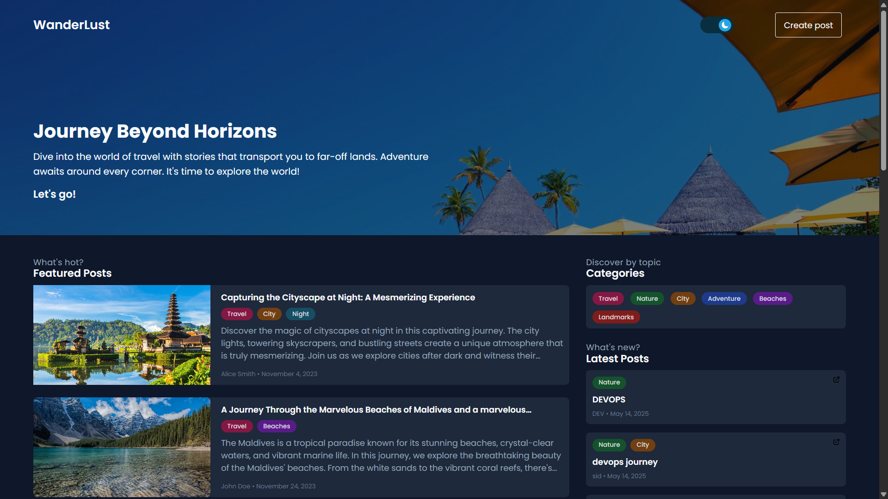
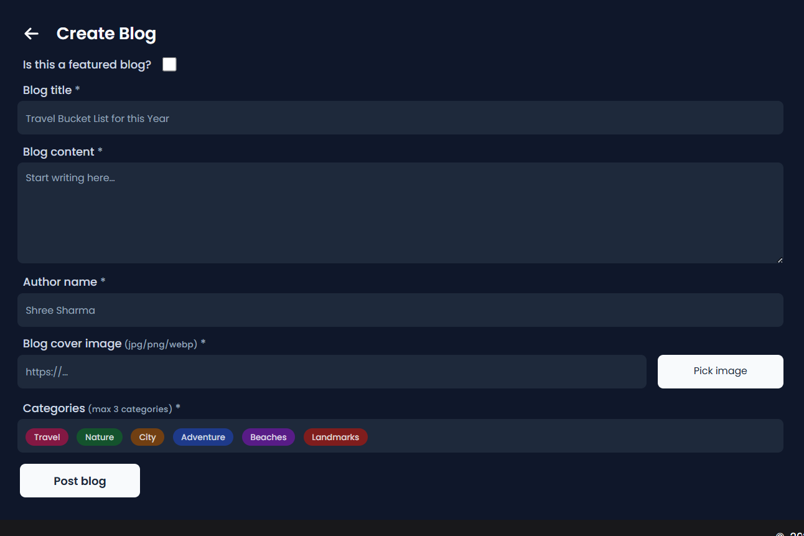

# Wanderlust - Your Ultimate Travel Blog 🌍✈️

WanderLust is a simple MERN travel blog website ✈ This project is aimed to help people to contribute in open source, upskill in react and also master git.



---



# Wanderlust Mega Project End to End Implementation

## Tech stack used in this project:
- GitHub (Code)
- Docker (Containerization)
- Docker Compose

## Installation:

```bash
sudo apt-get update
```
```bash
sudo apt-get install docker.io -y
sudo usermod -aG docker ubuntu && newgrp docker
```

---

## How to run Wanderlust Project:

- Clone the below Repository
```bash
git clone https://github.com/sidraut007/MERN-Wanderlust-3-Tier.git

cd MERN-Wanderlust-3-Tier/
```

- We are using docker compose:
    - docker compose up -d 

- Access Application on: http://localhost:5173

## Data Insertion Into Database:
```bash
docker cp ./backend/data/ mongo-service:/data/

mongoimport --db wanderlust --collection posts --file ./data/sample_posts.json --jsonArray

```